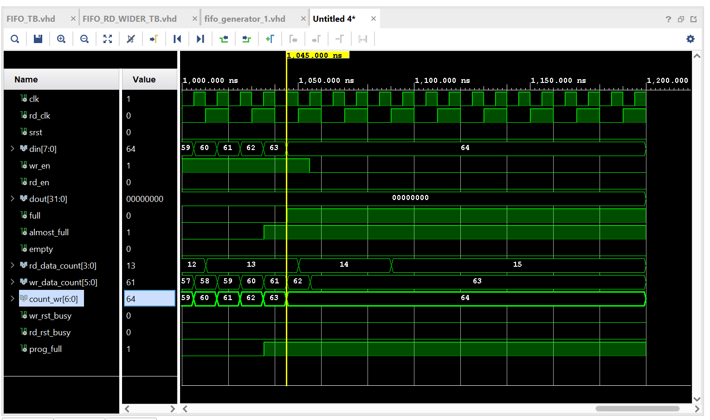
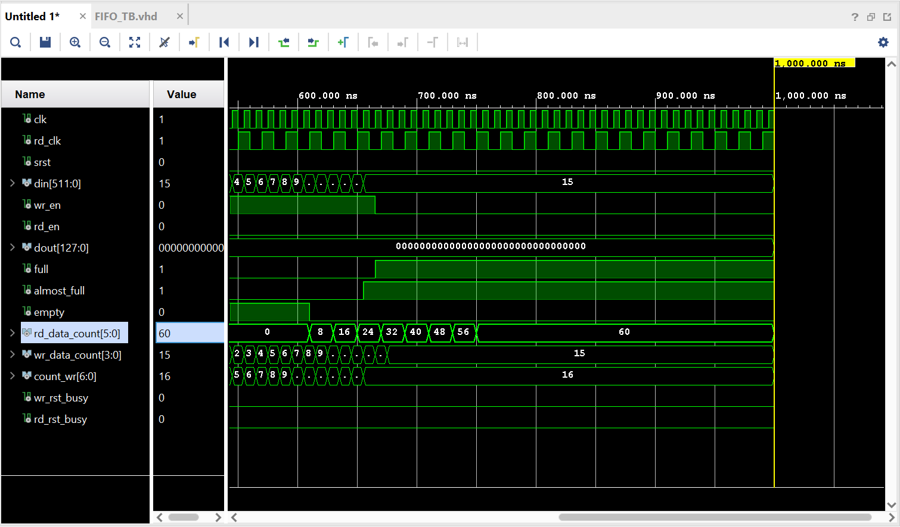
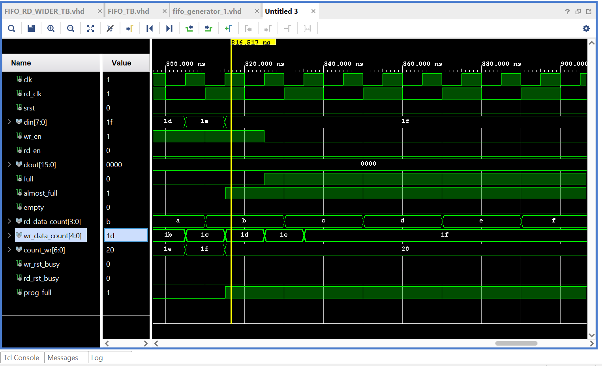

# Vivado FIFO Non-symmetric Aspect Ratio Study
This study was conducted using Vivado FIFOs with Independent Clock Domains since I was not able to replicate this issue/behavior on a common clock domain. Wr_clk = 100mhz & Rd_clk = 50mhz.

## FIFO Results (Almost Full Flag, rd_data_count, and wr_data_count were enabled)
1. Independent Clocks Block RAM, 8 bit Wr Port, 32 bit Rd Port, 64 (Vivado limits to 63) Write Depth, 16 (Vivado Limits to 15) Read Depth

In this Simulation, we can see that the full and almost_full flag asserts correctly
2. Independent Clocks Block RAM, 8 bit Wr Port, 16 bit Rd Port, 32 (Vivado limits to 31) Write Depth, 16 (Vivado Limits to 15) Read Depth

3. Independent Clocks Block RAM, 512 bit Wr Port, 128 bit Rd Port, 16 Write Depth, 64 Read Depth

